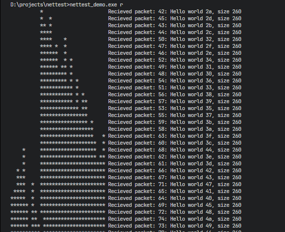

# NetTest
A small layer on top of Berkley sockets to simulate packet loss, delay, reodering and duplication to debug custom networking protocols.

Currently only supports Windows

## Usage
This is a [STB-style](https://github.com/nothings/stb?tab=readme-ov-file#why-single-file-headers) single-header library, so you can just paste `nettest.h` directly into your project.

In *exactly* one C/C++ file define `NETTEST_IMPLEMENTATION` before including:
```cpp
#define NETTEST_IMPLEMENTATION 1
#include "nettest.h"

// rest of your code...
```

## Demo

Build with `x64 Native Tools Command Prompt for VS` using `cl nettest_demo.cpp`


